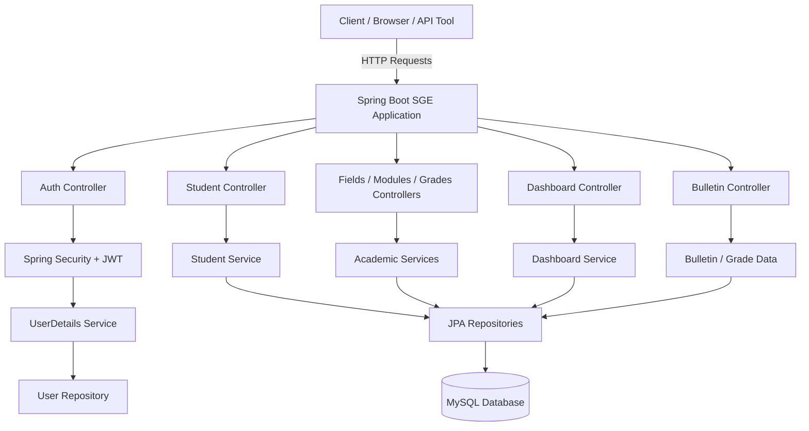
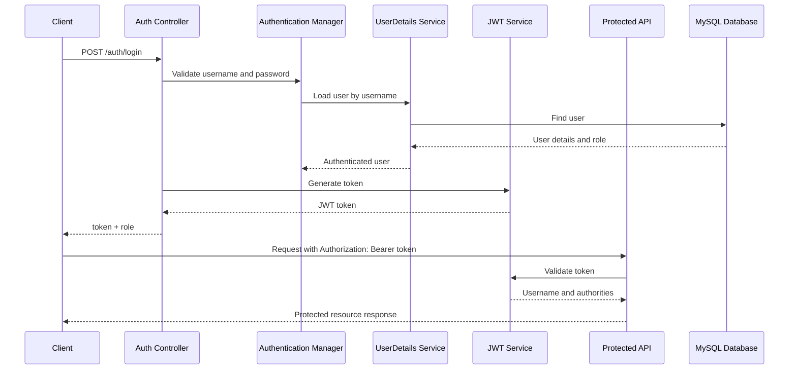
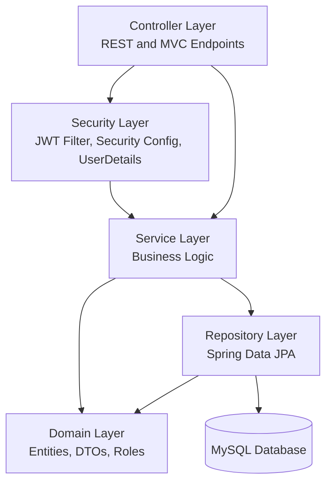

# SGE - Spring Boot Student Management System

SGE is a Spring Boot student management system for managing students, academic fields, modules, grades, bulletins, dashboard statistics, and user authentication. The application exposes REST endpoints secured with JWT and role-based authorization.

## Tech Stack

- Java 17
- Spring Boot 4.0.5
- Spring Web MVC
- Spring Data JPA
- Spring Security
- JWT with JJWT 0.11.5
- MySQL
- Maven
- Thymeleaf

## Authentication System

SGE uses JWT authentication.

Users authenticate through `/auth/login` with a username and password. After successful authentication, the API returns a JWT token and the user role. Protected endpoints require the token in the `Authorization` header:

```http
Authorization: Bearer <jwt-token>
```

Registration is available through `/auth/register`. The request includes `username`, `password`, and `role`.

## Role-Based Access

The application supports two roles:

- `ADMIN`: Full management access for students, fields, modules, and grades.
- `USER`: Read access for allowed student and grade resources.

Access rules:

- `/auth/**`: Public
- `/bulletins/**`: Public
- `/filieres/**`: `ADMIN`
- `/modules/**`: `ADMIN`
- `GET /notes/**`: `ADMIN` or `USER`
- Other `/notes/**` methods: `ADMIN`
- `GET /etudiants/**`: `ADMIN` or `USER`
- `POST /etudiants/**`: `ADMIN`
- `PUT /etudiants/**`: `ADMIN`
- `DELETE /etudiants/**`: `ADMIN`
- Other authenticated routes: valid JWT required

## API Endpoints

### Authentication

| Method | Endpoint | Description | Access |
| --- | --- | --- | --- |
| `POST` | `/auth/register` | Register a new user and return a JWT | Public |
| `POST` | `/auth/login` | Authenticate user and return a JWT | Public |

### Students

| Method | Endpoint | Description | Access |
| --- | --- | --- | --- |
| `POST` | `/etudiants` | Create a student | `ADMIN` |
| `GET` | `/etudiants` | List all students | `ADMIN`, `USER` |
| `GET` | `/etudiants/{id}` | Get a student by ID | `ADMIN`, `USER` |
| `PUT` | `/etudiants/{id}` | Update a student | `ADMIN` |
| `DELETE` | `/etudiants/{id}` | Delete a student | `ADMIN` |
| `GET` | `/etudiants/recherche` | Search students | `ADMIN`, `USER` |
| `GET` | `/etudiants/groupe` | List students by group | `ADMIN`, `USER` |
| `GET` | `/etudiants/admis` | List admitted students | `ADMIN`, `USER` |
| `GET` | `/etudiants/meilleurs` | List top students | `ADMIN`, `USER` |
| `GET` | `/etudiants/page` | Get paginated students | `ADMIN`, `USER` |

### Fields

| Method | Endpoint | Description | Access |
| --- | --- | --- | --- |
| `POST` | `/filieres` | Create a field | `ADMIN` |
| `GET` | `/filieres` | List all fields | `ADMIN` |
| `GET` | `/filieres/{id}` | Get a field by ID | `ADMIN` |
| `PUT` | `/filieres/{id}` | Update a field | `ADMIN` |
| `DELETE` | `/filieres/{id}` | Delete a field | `ADMIN` |

### Modules

| Method | Endpoint | Description | Access |
| --- | --- | --- | --- |
| `POST` | `/modules` | Create a module | `ADMIN` |
| `GET` | `/modules` | List all modules | `ADMIN` |
| `GET` | `/modules/{id}/etudiants` | List students for a module | `ADMIN` |
| `DELETE` | `/modules/{id}` | Delete a module | `ADMIN` |

### Grades

| Method | Endpoint | Description | Access |
| --- | --- | --- | --- |
| `POST` | `/notes` | Create a grade | `ADMIN` |
| `GET` | `/notes/etudiant/{id}` | List grades for a student | `ADMIN`, `USER` |
| `GET` | `/notes/module/{id}` | List grades for a module | `ADMIN`, `USER` |
| `GET` | `/notes/moyenne/{etudiantId}` | Get student average | `ADMIN`, `USER` |
| `PUT` | `/notes/{id}` | Update a grade | `ADMIN` |
| `DELETE` | `/notes/{id}` | Delete a grade | `ADMIN` |

### Bulletins

| Method | Endpoint | Description | Access |
| --- | --- | --- | --- |
| `GET` | `/bulletins` | Display bulletin list view | Public |
| `GET` | `/bulletins/{etudiantId}` | Display student bulletin details | Public |

### Dashboard

| Method | Endpoint | Description | Access |
| --- | --- | --- | --- |
| `POST` | `/dashboard/filiere` | Change dashboard field filter | Authenticated |
| `GET` | `/dashboard/stats` | Get dashboard statistics | Authenticated |
| `DELETE` | `/dashboard/reset` | Reset dashboard data | Authenticated |

## Database Setup

The project is configured to use MySQL.

Default database configuration:

```properties
server.port=8083
spring.datasource.url=jdbc:mysql://localhost:3306/base11
spring.datasource.username=root
spring.datasource.password=
spring.jpa.hibernate.ddl-auto=update
```

Create the MySQL database before running the application:

```sql
CREATE DATABASE base11;
```

If your MySQL username or password is different, update the database connection values in `src/main/resources/application.properties`.

## How to Run the Project

From the project directory:

```bash
mvn spring-boot:run
```

The application starts on:

```text
http://localhost:8083
```

To build the project:

```bash
mvn clean package
```

To run the packaged application:

```bash
java -jar target/sge-0.0.1-SNAPSHOT.jar
```

## Default Admin Credentials

The application seeds a default admin user:

```text
Username: test123
Password: test123
Role: ADMIN
```

## Architecture

### System Architecture Diagram



### Security Flow Diagram



### Simple Layered Architecture


